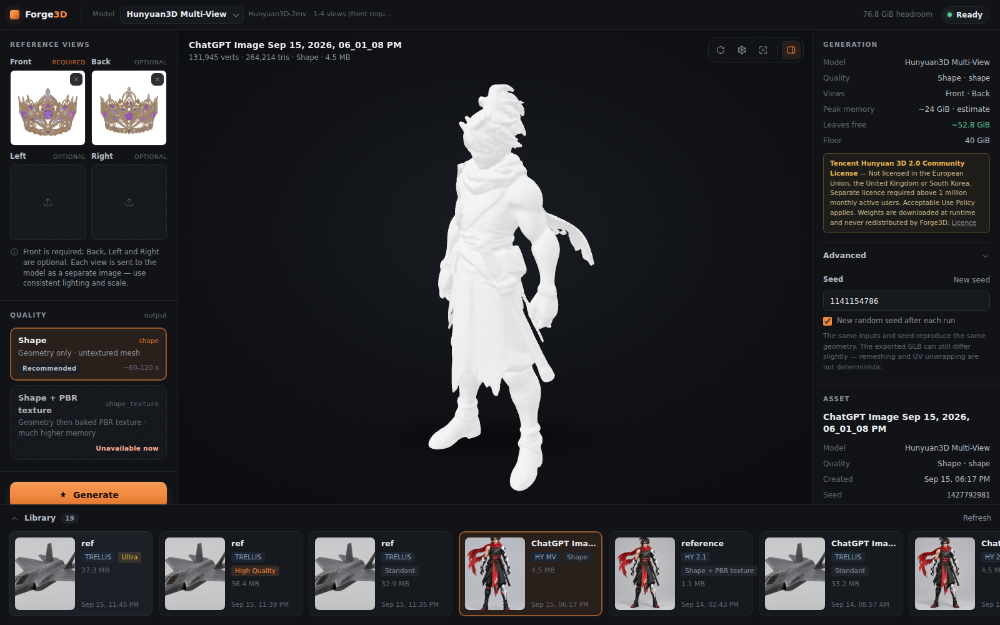

# Forge3D

Local AI 3D asset generation, developed and tested on NVIDIA DGX Spark / GB10 hardware.
Generate meshes from reference images, inspect them in the browser, and export GLB files for Blender or a game asset pipeline.

| Backend | Best for | Inputs |
| --- | --- | --- |
| **Microsoft TRELLIS.2** | Highest-quality textured results in the current workflow | One image |
| **Hunyuan3D 2.1** | Faster geometry; optional baked texture | One image |
| **Hunyuan3D Multi-View** | Controlled geometry from multiple references | Front required; back, left and right optional |

```text
Reference image(s) → Forge3D → backend selection → local generation → GLB
                                                                    → optional Blender / game pipeline
```



## Current features

- Local inference with three selectable generators; no hosted generation API.
- PNG, JPEG and WebP references, including transparent images; up to four named views for Multi-View.
- Backend-specific quality modes, TRELLIS texture resolution, and seed controls.
- Job stages, live memory/headroom reporting, and generation error messages.
- Three.js GLB viewer with orbit, zoom, wireframe and reference comparison.
- Persistent local asset library: preview, rename, reuse settings, delete and download.
- Optional **Exclusive / Max Quality** mode for TRELLIS, using a narrowly scoped host helper.

## Requirements and supported hardware

**NVIDIA DGX Spark / Linux ARM64 (GB10, 128 GB unified memory): tested.** The validation host is a GIGABYTE AI TOP ATOM with the same GB10 platform, running Ubuntu 24.04 LTS, NVIDIA driver **580.173.02**, Docker **29.2.1**, Compose **5.0.2**, and NVIDIA Container Toolkit **1.20.0** with the `nvidia` runtime registered.

Other NVIDIA Linux hardware is **untested**. These images explicitly compile extensions for **sm_121**; this is not currently a portable GPU installer. CPU-only, Windows-native and macOS inference are not supported by this setup.

Host tools: Git, Docker Engine with Compose, NVIDIA Container Toolkit, and `curl` / Python 3 for the supplied status and check commands. The optional helper also needs systemd and sudo. If Docker or GPU passthrough is missing, follow the [Docker Ubuntu guide](https://docs.docker.com/engine/install/ubuntu/) and [NVIDIA Container Toolkit guide](https://docs.nvidia.com/datacenter/cloud-native/container-toolkit/latest/install-guide.html) before continuing.

The Dockerfiles install the build tools, system libraries and Python dependencies:

| Image | Runtime |
| --- | --- |
| TRELLIS | Ubuntu 24.04, Python 3.12, CUDA **12.9.1** + cuDNN, PyTorch **2.9.1+cu129**, transformers **4.57.1** |
| Hunyuan | Ubuntu 22.04, Python 3.10, CUDA **12.9.1** + cuDNN, PyTorch **2.9.1+cu129**, transformers **4.46.0** / diffusers **0.30.0** |

A compatible NVIDIA driver is required on the host; the CUDA compiler is supplied inside the images. The tested driver reports CUDA 13.0 while the images use CUDA 12.9. No host Blender, Node.js or Python ML environment is required.

Builds compile ARM64 CUDA extensions and can take tens of minutes. Plan substantial free disk space: the recorded images are about **19 GB + 21 GB**, current model caches about **46 GiB**, plus temporary build layers and generated assets. More than 100 GB free is sensible for both backends, rather than a guaranteed minimum.

## Install and configure

### Install with a coding agent

Forge3D ships [`AGENTS.md`](AGENTS.md), a complete instruction set for an
autonomous coding agent (Codex, Claude Code, Hermes, or any capable shell agent),
plus a read-only host inspection script. Paste the following into an agent that
is running **on the machine you want Forge3D installed on**:

```text
You are on the machine where I want Forge3D installed.

Clone https://github.com/Tacdelgineer/Forge3D.git and read README.md, AGENTS.md
and docs/SETUP.md before changing anything.

Run ./scripts/preflight.sh and tell me whether this machine matches the tested
NVIDIA DGX Spark / GB10 / Linux ARM64 / sm_121 configuration. Classify it as
TESTED, UNTESTED or UNSUPPORTED and say which. If it is not TESTED, stop and
report the blockers instead of adapting the stack to fit.

If it is compatible, install using the repository's documented Docker setup.
Preserve all tested dependency pins, the sm_121 build flags and patches, the
source-built torchvision, the unified-memory safeguards
(TRELLIS_MIN_AVAILABLE_GB and TRELLIS_PROTECTED_FLOOR_GB), the 127.0.0.1 bind
address, and the model-cache locations. Do not "simplify" or modernise any of it.

Do not expose Forge3D publicly: keep the loopback bind, do not publish port 8189,
and do not touch firewall or router configuration. Do not print secrets.

Build TRELLIS only unless I ask for the optional Hunyuan backends.

If Hugging Face approval or an HF token is required, stop at that human-only step
and tell me exactly what I need to do locally. Never ask me to paste a token into
this chat -- I will put it into .env myself. Continue from the documented setup
once I confirm it is done.

Start Forge3D and run the lightweight verification ladder in AGENTS.md (steps A
through F: compose config, containers up, GPU visible in the container,
verify_stack.py, /health and /system, and the step5 checks). Confirm the UI is
reachable, then report:
  - detected hardware and the support classification
  - installed backends
  - local access URL
  - validation results
  - anything still requiring manual action

Do not run a full 3D generation unless I explicitly ask -- it costs minutes of
GPU time and tens of GiB of unified memory.
```

The agent can inspect the host, install, start and verify Forge3D. It must stop
and hand back to you for Hugging Face gated approval and the token, and for
anything needing `sudo`. See [`AGENTS.md`](AGENTS.md) for the full flow, the
support classification, the verification ladder and the troubleshooting map.

### Install manually

```bash
git clone https://github.com/Tacdelgineer/Forge3D.git
cd Forge3D
./scripts/preflight.sh          # read-only host check; installs nothing
cp .env.example .env
mkdir -p data/uploads data/outputs models/hunyuan
printf '\nUID=%s\nGID=%s\n' "$(id -u)" "$(id -g)" >> .env
```

`scripts/preflight.sh` reports OS, architecture, memory, GPU and compute
capability, driver, Docker, Compose, the NVIDIA runtime, free disk and host
tools, and says whether the machine matches the tested configuration. It prints
no tokens or private addresses. Add `--gpu-test` to also prove container GPU
passthrough using a CUDA image already present locally.

Edit `.env` and set `HF_TOKEN` to a Hugging Face **read** token. Request access using the same account at:

- [facebook/dinov3-vitl16-pretrain-lvd1689m](https://huggingface.co/facebook/dinov3-vitl16-pretrain-lvd1689m) — gated; wait for approval.
- [briaai/RMBG-2.0](https://huggingface.co/briaai/RMBG-2.0) — gated; accept the terms, including the commercial-use restriction.

TRELLIS constructs both dependencies when loading its pipeline, even for an already transparent input. A token alone does not grant access. `.env` is ignored; never put tokens in a Dockerfile, commit, screenshot or issue.

```bash
# Validate Compose without printing resolved tokens, then build TRELLIS.
docker compose config --quiet
docker compose build trellis

# Optional: build the separate Hunyuan worker.
docker compose --profile hunyuan build hunyuan
```

`MAX_JOBS=4` in the example limits compilation parallelism. Lower it if the build competes with other workloads. Build dependencies and compatibility patches are already in the Dockerfiles; retain their pins.

## Start and access the UI

```bash
docker compose up -d trellis
# Optional: enable both Hunyuan generators.
docker compose --profile hunyuan up -d hunyuan
```

Open **http://127.0.0.1:8189/** on the host. From another computer, keep the default loopback bind and tunnel over SSH (replace `your-dgx-host` with your SSH destination):

```bash
ssh -N -L 8189:127.0.0.1:8189 your-dgx-host
```

Then open the same URL locally. Alternatively set `FORGE3D_BIND` to your own trusted interface address and access that address on port 8189. **The UI has no authentication.** Docker port publishing can bypass firewall rules; do not expose it publicly or bind `0.0.0.0` casually. The Hunyuan worker's host port **8190** is loopback-only; Forge3D reaches it over the Compose network.

```bash
./scripts/status.sh               # assumes the default loopback UI bind
docker compose logs -f trellis
docker compose --profile hunyuan logs -f hunyuan
# Stop both backends; cached weights and outputs remain.
docker compose --profile hunyuan down
```

`./scripts/start.sh` is also available for TRELLIS. It checks raw host MemAvailable before starting, so it can refuse when existing resident models leave less than 65 GiB free. The app's per-job assessment also credits memory reusable by the selected backend.

## Models and first run

Models load lazily on the first generation, not when the web UI starts. First use needs internet access, downloads weights, and can include CUDA/PTX warm-up; subsequent runs reuse local caches.

| Model / dependency | Download and storage |
| --- | --- |
| TRELLIS.2-4B + DINOv3 + RMBG | Main weights about 16 GB plus dependencies; cached under `models/hf/` |
| Hunyuan3D 2.1 + Hunyuan3D-2mv | Downloaded on demand; the current Hunyuan cache is about 29 GiB under `models/hunyuan/` |
| Hunyuan background removal | Downloaded on demand under `models/hunyuan/u2net/` |
| Real-ESRGAN upscaler | Downloaded during the Hunyuan image build, inside that image |

The Hunyuan repositories are currently ungated; `HF_TOKEN` is needed for the TRELLIS gated dependencies. No model weights or generated GLBs are stored in Git. Upstream terms still apply to every downloaded dependency; see [third-party licensing](docs/THIRD_PARTY.md).

## Quality and memory

| Generator | UI mode | Behavior | Configured whole-run peak / required cold headroom* |
| --- | --- | --- | --- |
| TRELLIS | Standard | 512 geometry; recommended starting point | 27 / 67 GiB |
| TRELLIS | High Quality | 1024 cascade geometry | 44 / 84 GiB |
| TRELLIS | Ultra — experimental | Up to 1536 cascade; upstream can reduce resolution to fit its token budget | 48 / 88 GiB |
| Hunyuan 2.1 / Multi-View | Shape | Untextured geometry | 22 / 65 and 24 / 65 GiB |
| Hunyuan 2.1 / Multi-View | Shape + PBR texture | Shape followed by the **2.1 paint pipeline** | 56 / 96 and 58 / 98 GiB |

\* Defaults from `app/config.py`: required headroom is `max(65, peak + 40)` GiB. On GB10, CPU and GPU share the same memory pool. A warm job credits only its backend's reusable footprint; another backend's resident weights still consume memory.

TRELLIS texture sizes are 1024, 2048 or 4096 pixels, independently of geometry mode; 4096 is the default. Reference-dependent runtimes vary: recorded warm TRELLIS runs were roughly 100–210 seconds, Hunyuan shape roughly 60–120 seconds. Downloads and initial loading add time.

The **40 GiB protected floor is a pre-flight projection, not a hard memory cap**. Some observed peaks exceeded configured estimates slightly; leave extra headroom and avoid concurrent heavy jobs. Hunyuan texturing is particularly expensive. Its verified 2.1 GLB contained baked albedo, not a complete metallic/roughness/normal PBR set; Multi-View texturing remains unverified. Generated assets can need cleanup before game use.

Exclusive / Max Quality temporarily releases configured Ollama residency and Hunyuan pipelines, and pauses the fixed `pipeline-worker.service` if active. It restores the prior service state and pinned Ollama models; Hunyuan reloads lazily. It **does not lower the memory floor**. This optional, host-specific integration must be configured before use; see [setup and recovery](docs/SETUP.md).

## Environment variables

Copyable defaults and comments live in [`.env.example`](.env.example). Compose currently passes these settings:

| Variable | Default / purpose |
| --- | --- |
| `HF_TOKEN` | Empty; read token with the gated access above |
| `FORGE3D_BIND` | `127.0.0.1`; host UI interface, port 8189 |
| `UID`, `GID` | `1000`; set to your host IDs for writable mounts |
| `MAX_JOBS` | Example: `4`; CUDA build parallelism |
| `TRELLIS_MODEL_REPO` | `microsoft/TRELLIS.2-4B` |
| `TRELLIS_PIPELINE_TYPE` | `512`; default TRELLIS geometry mode |
| `ATTN_BACKEND` | `flash_attn`; retain the tested default |
| `TRELLIS_MIN_AVAILABLE_GB` | `65`; minimum per-job headroom |
| `TRELLIS_PROTECTED_FLOOR_GB` | `40`; projected memory floor |
| `HUNYUAN_URL` | `http://hunyuan:8190`; internal worker endpoint |
| `FORGE3D_RESCTL_DIR`, `FORGE3D_RESCTL_SOCKET` | `/run/forge3d-resctl`, `/run/forge3d-resctl/resctl.sock` |
| `FORGE3D_EXCLUSIVE_LEASE_S` | `1800`; host-helper recovery lease |

Editing `.env` does not automatically pass arbitrary app variables through Compose. Runtime-only overrides, cache paths and optional helper settings are explained in [SETUP.md](docs/SETUP.md). Apply Compose environment changes with `docker compose up -d trellis`.

## Outputs and light checks

Downloads are ordinary GLB files. Host storage is `data/outputs/<asset-id>/model.glb` with `metadata.json`; references live in `data/uploads/<asset-id>/`. Both directories are ignored by Git and persist across container replacement. Job status is in-process and resets on restart; completed assets remain in the library.

```bash
# Neither check generates a 3D asset.
docker compose exec -T trellis python - < scripts/test_step5.py
# For the tested host with helper + releasable workloads installed:
docker compose exec -T trellis python - < scripts/test_step6.py
```

`test_step6.py` exercises the exclusive-mode gate. One of its cases only applies
while memory is tight, so it checks `/system` and reports `[SKIP]` when the gate
legitimately allows Ultra — posting that job on a machine with free memory would
start a real generation. Keep that guard if you edit the script.

For a new GPU build, the existing `scripts/verify_stack.py` and `scripts/verify_hunyuan.py` check imports and small CUDA kernels without a full generation; invocation details are in [SETUP.md](docs/SETUP.md). [`AGENTS.md`](AGENTS.md) arranges the same checks as an ordered ladder, cheapest first.

## What Forge3D does not do

**Forge3D makes generated GLBs. It does not automatically make every output game-ready.**

A result is a mesh with baked textures. Rigging, retopology and optimisation, LODs, collision, engine-specific material and shader setup, animation, and import conventions are outside Forge3D's scope, and generated assets commonly need cleanup before game use. TRELLIS emits baked PBR maps; the verified Hunyuan 2.1 GLB contained baked albedo rather than a complete metallic/roughness/normal set, and Multi-View texturing remains unverified.

That downstream work belongs to a separate Blender / game asset pipeline — the `game-3d-asset-pipeline` Skill repository is the intended companion for it. It is **not** a dependency: Forge3D installs, runs and produces GLBs without it, and installing Forge3D does not install or require it.

## Troubleshooting

[`AGENTS.md`](AGENTS.md) carries the same symptoms as a symptom → cause → action map written for an install agent, including what *not* to change in response.

| Symptom | Check |
| --- | --- |
| 401 / 403 or gated-model load failure | Token belongs to the approved HF account and includes read access; both gated repositories must be approved. Recreate TRELLIS after changing `.env`. |
| Hunyuan unavailable in the selector | Build/start the `hunyuan` profile; check worker logs and port 8190. |
| Insufficient memory / a disabled quality mode | Use the displayed per-mode reason. Other resident models consume unified memory. Prefer Standard or Shape; do not bypass the floor to force a job. |
| Hunyuan retains memory after unloading | Its allocator can retain several GiB. If the worker is idle, `docker compose --profile hunyuan restart hunyuan` releases process-held memory; models reload on demand. |
| `no kernel image` or torchvision CUDA failure | Keep the sm_121 extension builds and TRELLIS's source-built torchvision. A generic ARM64 torchvision wheel lacks the needed deformable-convolution kernel. |
| Hunyuan `pkg_resources`, `libharfbuzz`, or remesh failure | Rebuild using the current Hunyuan Dockerfile; it includes setuptools<81, required GL/font libraries and Open3D 0.18.0. |
| Permission denied / cache errors | Match `.env` UID/GID to the mount owner. Hunyuan uses writable `/tmp` caches and `/models` for persistent weights; retain those image settings. |
| Helper unavailable or a workload left paused | Follow [SETUP.md](docs/SETUP.md), including socket ownership and `sudo forge3d-resctl recover`. |

## Project status and licensing

Forge3D is an early, working local tool with one generation at a time, a host-specific GPU build, and no authentication or durable job queue. TRELLIS quality modes, Hunyuan 2.1 shape/texturing, and Multi-View shape have recorded successful runs; this cleanup does not revalidate model quality. Earlier `docs/step-*` files are historical milestone records, not the current installation guide.

**Source-license selection is pending.** Do not treat the whole repository or its model weights as MIT-licensed. Hunyuan's community licenses have territory/use restrictions; RMBG and the installed NVIDIA rendering libraries restrict commercial use. Build-recipe provenance and Hunyuan provider identification also need maintainer review before an unqualified open-source release claim. See [THIRD_PARTY.md](docs/THIRD_PARTY.md). Forge3D is independent; Tencent is not affiliated with, sponsoring or endorsing it.

[Agent install guide](AGENTS.md) · [Architecture](docs/ARCHITECTURE.md) · [Setup details](docs/SETUP.md) · [Third-party terms](docs/THIRD_PARTY.md)

## Roadmap — future work

- Packaged one-click installer (Pinokio / DGX Spark). Not built yet; the current
  supported path is the Git clone plus Docker setup above, driven by hand or by an
  agent following [`AGENTS.md`](AGENTS.md).
- Additional generation backends and quality improvements.
- Blender automation and asset-pipeline integration.
- Broader NVIDIA hardware testing.
